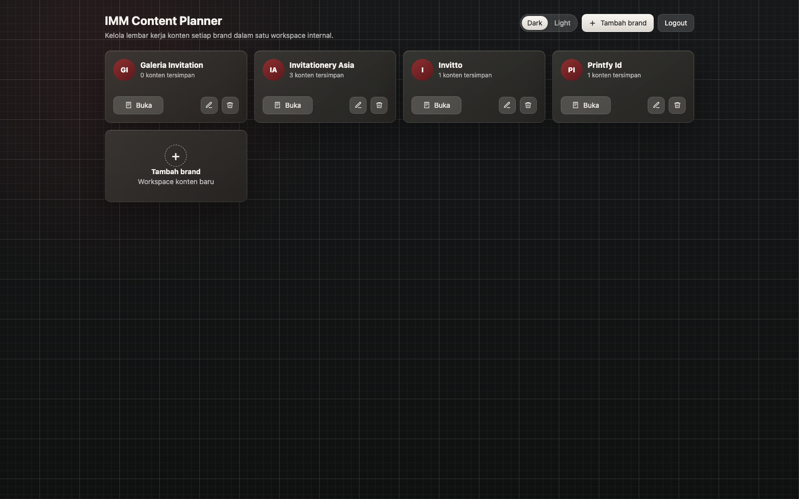
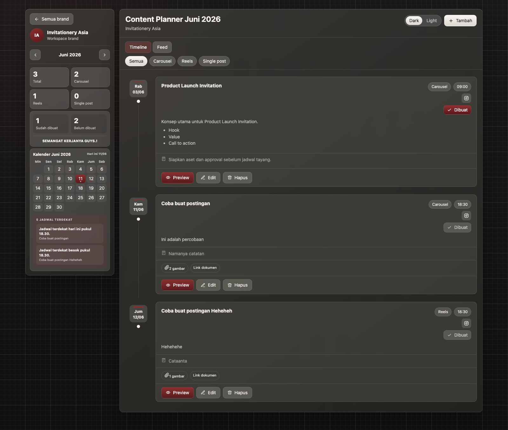

# IMM Content Planner

IMM Content Planner adalah aplikasi internal berbasis Laravel untuk mengelola workspace brand dan jadwal konten media sosial bulanan. Aplikasi menyediakan kalender interaktif, timeline, feed, pengingat jadwal terdekat, penyimpanan media privat, tipe konten dinamis, serta preview dan download PDF.

## Tampilan Aplikasi

### Daftar workspace brand



### Workspace content planner



## Fitur Utama

- Autentikasi berbasis session dengan reset password.
- Pemisahan data berdasarkan pemilik brand.
- CRUD brand beserta logo.
- Grid workspace brand responsif hingga empat kolom pada desktop.
- Kalender bulanan interaktif dengan daftar jadwal pada tanggal yang dipilih.
- Lima pengingat jadwal konten terdekat yang dapat diklik.
- Sidebar workspace sticky dan dapat di-scroll pada layar desktop.
- Tampilan konten dalam mode **Timeline** dan **Feed**.
- Filter berdasarkan tipe konten.
- Tipe konten bawaan dan tipe kustom per brand.
- Platform Instagram dan TikTok per jadwal.
- Input jam konsisten dalam format 24 jam pada Windows dan macOS.
- Rich text sederhana untuk detail, script, dan catatan.
- Maksimal 12 gambar per konten, masing-masing maksimal 5 MB.
- Media yang sudah ada dapat dipertahankan, dihapus, atau ditambah saat mengedit konten.
- Penyimpanan media lokal atau Cloudflare R2.
- Status konten sudah atau belum dibuat.
- Draft form tetap tersimpan saat modal tertutup selama halaman belum dimuat ulang.
- Preview konten, preview PDF inline, dan download PDF langsung.
- Tema gelap dan terang.
- Toast notification yang dapat ditutup dan hilang otomatis.
- Favicon dan identitas visual IMM.

## Teknologi

| Bagian | Teknologi |
|---|---|
| Backend | PHP 8.3+, Laravel 13 |
| Frontend | Blade, vanilla JavaScript, CSS |
| Build tool | Vite 8 |
| Database | SQLite atau MySQL |
| Object storage | Local filesystem atau Cloudflare R2 |
| PDF | Dompdf 3 |
| Test | PHPUnit 12 |
| Code style | Laravel Pint |

## Persyaratan

- PHP `8.3` atau lebih baru.
- Composer `2`.
- Node.js `20` atau lebih baru.
- npm.
- Ekstensi PHP yang diperlukan Laravel.
- SQLite untuk setup lokal sederhana, atau MySQL.
- Kredensial Cloudflare R2 jika media disimpan di R2.

## Instalasi Lokal

### 1. Ambil source code dan install dependency

```bash
composer install
npm install
cp .env.example .env
php artisan key:generate
```

### 2. Pilih database

#### Opsi A: SQLite

```bash
touch database/database.sqlite
```

Atur `.env`:

```dotenv
DB_CONNECTION=sqlite
DB_DATABASE=/absolute/path/project/database/database.sqlite
```

#### Opsi B: MySQL

Buat database kosong, kemudian atur `.env`:

```dotenv
DB_CONNECTION=mysql
DB_HOST=127.0.0.1
DB_PORT=3306
DB_DATABASE=content_planner
DB_USERNAME=root
DB_PASSWORD=
```

### 3. Pilih penyimpanan media

Untuk pengembangan lokal tanpa R2:

```dotenv
MEDIA_DISK=public
MEDIA_VISIBILITY=public
```

Kemudian buat symbolic link:

```bash
php artisan storage:link
```

Untuk Cloudflare R2, lihat bagian [Konfigurasi Cloudflare R2](#konfigurasi-cloudflare-r2).

### 4. Jalankan migrasi dan seeder

```bash
php artisan migrate --seed
```

Seeder membuat akun admin lokal dan beberapa contoh brand serta jadwal konten.

### 5. Build dan jalankan aplikasi

Mode pengembangan:

```bash
composer run dev
```

Perintah tersebut menjalankan web server Laravel, queue listener, log viewer, dan Vite secara bersamaan. Secara default aplikasi tersedia di:

```text
http://127.0.0.1:8000
```

Build frontend tanpa development server:

```bash
npm run build
php artisan serve
```

## Akun Seeder

Akun admin dapat dikonfigurasi sebelum menjalankan seeder:

```dotenv
CONTENT_PLANNER_ADMIN_NAME="Admin Content Planner"
CONTENT_PLANNER_ADMIN_EMAIL=admin@example.com
CONTENT_PLANNER_ADMIN_PASSWORD=change-this-password
```

Jika nilainya kosong, fallback khusus pengembangan adalah:

```text
Email    : admin@imm.local
Password : password
```

Jangan gunakan kredensial fallback tersebut pada production. Registration sengaja dinonaktifkan, sehingga akun pengguna perlu dibuat melalui seeder, database administration, atau proses provisioning internal.

## Konfigurasi Cloudflare R2

Media tidak disimpan sebagai base64 atau binary di database. Database hanya menyimpan object key, nama file, MIME type, ukuran, dan urutan gambar.

### Private mode

```dotenv
MEDIA_DISK=r2
MEDIA_VISIBILITY=private

R2_ACCESS_KEY_ID=your-access-key
R2_SECRET_ACCESS_KEY=your-secret-key
R2_BUCKET=imm-content-planner
R2_ENDPOINT=https://<ACCOUNT_ID>.r2.cloudflarestorage.com
R2_URL=
R2_DEFAULT_REGION=us-east-1
R2_USE_PATH_STYLE_ENDPOINT=false
R2_THROW_EXCEPTIONS=true
```

Pada private mode:

- File tidak membutuhkan public bucket.
- Laravel memeriksa autentikasi dan kepemilikan sebelum men-stream media.
- URL media menggunakan route aplikasi.
- `php artisan storage:link` tidak diperlukan.

### Public mode

```dotenv
MEDIA_DISK=r2
MEDIA_VISIBILITY=public
R2_URL=https://media.example.com
```

Public mode menghasilkan URL langsung melalui domain media. Pastikan kebijakan bucket dan Cloudflare sudah sesuai karena siapa pun yang memperoleh URL mungkin dapat mengakses file.

### Verifikasi koneksi R2

Pastikan konfigurasi sudah dimuat ulang:

```bash
php artisan config:clear
```

Kemudian uji upload logo atau gambar dari aplikasi. Kegagalan penyimpanan akan membatalkan transaksi database agar metadata tidak tersimpan tanpa objek media.

## Cara Menggunakan

### Mengelola brand

1. Login ke aplikasi.
2. Pilih **Tambah brand**.
3. Isi nama dan logo opsional.
4. Tekan **Buka** pada kartu brand untuk masuk ke workspace.

Setiap brand memiliki jadwal, tipe konten, dan media yang terpisah.

### Membuat jadwal konten

1. Buka workspace brand.
2. Tekan **Tambah**.
3. Pilih tanggal, jam dalam format 24 jam, tipe konten, dan platform.
4. Isi headline, detail atau script, dan catatan.
5. Tambahkan gambar atau link dokumen bila diperlukan.
6. Simpan konten.

Konten dapat diedit, dihapus, ditandai sudah dibuat, dipreview, serta diekspor ke PDF. Saat modal tertutup karena klik di luar form atau tombol tutup, draft tetap tersedia selama halaman belum dimuat ulang.

Saat mengedit media:

- Gambar lama secara default dipertahankan.
- Gambar tertentu dapat ditandai untuk dihapus.
- Upload baru ditambahkan sebagai media tambahan.
- Total gambar lama yang dipertahankan dan upload baru tidak boleh melebihi 12 file.

### Menambahkan tipe konten kustom

Tipe bawaan setiap brand adalah:

- Carousel
- Reels
- Single post

Pilih **+ Tambah tipe baru** pada field tipe konten untuk membuat pilihan seperti `Story`, `Live`, atau `UGC Video`. Tipe tersebut:

- Disimpan di tabel `content_types`.
- Tersedia kembali pada brand yang sama.
- Muncul pada filter dan statistik.
- Tidak otomatis tersedia untuk brand lain.

Jadwal menyimpan slug tipe agar data lama dan URL filter tetap kompatibel.

### Preview dan download PDF

1. Pilih **Preview** pada konten.
2. Tekan **Preview PDF** untuk membuka dokumen PDF pada tab baru.
3. Tekan **Download PDF** untuk mengunduh file secara langsung.

PDF dibuat server-side menggunakan Dompdf. Dokumen memuat identitas brand, jadwal, tipe konten, status, platform, detail atau script, catatan, media pendukung, dan link dokumen. Media privat dibaca dari storage dan ditanam ke PDF sehingga tidak membutuhkan URL bucket publik.

### Kalender dan pengingat

- Tanggal dengan jadwal ditandai titik pada kalender.
- Klik tanggal tersebut untuk melihat seluruh jadwal pada hari yang dipilih.
- Panel pengingat menampilkan maksimal lima jadwal terdekat.
- Setiap jadwal pada kalender dan pengingat dapat diklik untuk membuka preview konten.

## Struktur Data

| Tabel | Fungsi |
|---|---|
| `users` | Akun pengguna dan status aktif |
| `brands` | Workspace brand milik pengguna |
| `content_types` | Katalog tipe konten per brand |
| `content_plans` | Jadwal, platform, detail, dan status konten |
| `content_images` | Metadata dan object key gambar |
| `sessions` | Session login berbasis database |
| `cache`, `jobs` | Cache dan queue Laravel |

Relasi utama:

```text
User
└── Brand
    ├── ContentType
    └── ContentPlan
        └── ContentImage
```

Penghapusan brand menghapus jadwal, katalog tipe, metadata gambar, dan objek media terkait.

## Struktur Direktori Penting

```text
app/
├── Http/Controllers/       Controller autentikasi, brand, konten, dan media
├── Http/Requests/          Validasi request
├── Models/                 Model Eloquent
├── Policies/               Otorisasi berdasarkan kepemilikan
└── Services/               Sanitasi rich text, penyimpanan media, dan renderer PDF

database/
├── migrations/             Struktur database
├── factories/              Factory pengujian
└── seeders/                Akun dan data contoh

resources/
├── css/app.css             Seluruh styling aplikasi
├── js/app.js               Modal, draft form, editor, kalender, toast, dan preview
└── views/                  Blade templates

docs/screenshots/           Screenshot untuk dokumentasi
tests/Feature/              Test autentikasi, CRUD, media, kalender, dan PDF
```

## Route Utama

| Method | Path | Fungsi |
|---|---|---|
| `GET/POST` | `/login` | Login |
| `GET/POST` | `/forgot-password` | Permintaan reset password |
| `GET/POST` | `/reset-password/{token}` | Reset password |
| `GET` | `/brands` | Daftar workspace brand |
| `GET` | `/brands/{brand}/workspace` | Kalender dan content planner |
| `POST` | `/brands/{brand}/contents` | Membuat jadwal |
| `PUT/DELETE` | `/contents/{contentPlan}` | Edit atau hapus jadwal |
| `GET` | `/contents/{contentPlan}/preview` | Preview konten |
| `GET` | `/contents/{contentPlan}/pdf` | Preview PDF inline |
| `GET` | `/contents/{contentPlan}/pdf/download` | Download PDF |
| `GET` | `/contents/{contentPlan}/print` | Alias lama menuju preview PDF |
| `GET` | `/media/brands/{brand}/logo` | Logo brand private terotorisasi |
| `GET` | `/media/{contentImage}` | Media private terotorisasi |

Seluruh route workspace, konten, dan media membutuhkan pengguna aktif dan terautentikasi.

## Keamanan

- CSRF protection aktif untuk seluruh form.
- Password disimpan menggunakan hashing Laravel.
- Policies membatasi akses brand dan konten berdasarkan pemilik.
- Media private hanya dapat diakses melalui route terotorisasi.
- Rich text disanitasi sebelum disimpan.
- Upload dibatasi ke JPG, JPEG, PNG, dan WebP.
- Setiap gambar dibatasi maksimal 5 MB.
- Maksimal 12 gambar dapat disimpan pada setiap jadwal konten.
- Nama objek media menggunakan UUID.
- Respons PDF bersifat private dan tidak disimpan oleh shared cache.
- Secret `.env` tidak boleh masuk version control.
- Set `APP_DEBUG=false` pada production.

## Testing dan Quality Check

Jalankan seluruh test:

```bash
php artisan test
```

Periksa code style tanpa mengubah file:

```bash
./vendor/bin/pint --test
```

Perbaiki code style:

```bash
./vendor/bin/pint
```

Verifikasi frontend production:

```bash
npm run build
```

Periksa advisory dependency:

```bash
composer audit
```

Automated test menggunakan database terisolasi dan `Storage::fake()`. Test tidak menulis ke bucket R2 asli. Cakupannya termasuk otorisasi, penggantian logo, pengelolaan media, tipe konten kustom, kalender interaktif, format waktu 24 jam, draft modal, serta preview dan download PDF.

## Perintah Berguna

```bash
php artisan migrate
php artisan migrate:fresh --seed
php artisan db:seed
php artisan route:list
php artisan config:clear
php artisan cache:clear
php artisan optimize:clear
php artisan test
composer audit
npm run dev
npm run build
```

## Deployment Checklist

1. Set `APP_ENV=production`, `APP_DEBUG=false`, dan `APP_URL`.
2. Gunakan kredensial database production.
3. Set `APP_KEY` yang unik.
4. Konfigurasikan akun admin dengan password kuat.
5. Konfigurasikan R2 dan batasi izin token ke bucket yang diperlukan.
6. Jalankan dependency install dan build:

```bash
composer install --no-dev --optimize-autoloader
npm ci
npm run build
php artisan migrate --force
php artisan optimize
```

7. Pastikan web server mengarah ke direktori `public/`.
8. Jalankan queue worker bila queue digunakan untuk pekerjaan tambahan.
9. Konfigurasikan HTTPS, backup database, dan lifecycle object storage.

## Memperbarui Screenshot README

Jalankan Chrome headless dengan DevTools:

```bash
"/Applications/Google Chrome.app/Contents/MacOS/Google Chrome" \
  --headless=new \
  --remote-debugging-port=9222 \
  --user-data-dir=/tmp/imm-docs-chrome \
  --ignore-certificate-errors \
  about:blank
```

Pada terminal lain, jalankan:

```bash
APP_SCREENSHOT_URL=https://simple-content-planner.test \
APP_SCREENSHOT_EMAIL=admin@imm.local \
APP_SCREENSHOT_PASSWORD=password \
node scripts/capture-doc-screenshots.mjs
```

Script menggunakan viewport 1600 px, mengaktifkan tema gelap, memilih workspace brand pertama, lalu memperbarui:

```text
docs/screenshots/brand-workspaces.png
docs/screenshots/content-planner-workspace.png
```

Gunakan kredensial khusus dokumentasi bila mengambil screenshot dari environment selain lokal dan pastikan data sensitif tidak terlihat.

## Troubleshooting

### Perubahan `.env` belum terbaca

```bash
php artisan optimize:clear
```

### Gambar lokal tidak tampil

Pastikan konfigurasi menggunakan disk public dan symbolic link tersedia:

```dotenv
MEDIA_DISK=public
MEDIA_VISIBILITY=public
```

```bash
php artisan storage:link
```

### Upload R2 gagal

- Periksa access key, secret, bucket, endpoint, dan region.
- Pastikan API token memiliki izin read/write object.
- Pastikan `R2_ENDPOINT` adalah endpoint S3-compatible.
- Jalankan `php artisan config:clear` setelah mengubah `.env`.
- Periksa `storage/logs/laravel.log`.

### PDF tidak dapat dibuat

- Pastikan dependency terpasang dengan `composer install`.
- Pastikan PHP memiliki ekstensi yang dibutuhkan Dompdf.
- Periksa apakah object media masih tersedia pada disk yang dikonfigurasi.
- Periksa `storage/logs/laravel.log` untuk media yang gagal ditanam ke PDF.

### Login seed tidak bekerja

Jalankan ulang:

```bash
php artisan db:seed --class=ContentPlannerSeeder
```

Seeder menggunakan `updateOrCreate`, sehingga akun dengan email yang sama akan diperbarui.

### Reset password tidak mengirim email

Konfigurasi default menggunakan:

```dotenv
MAIL_MAILER=log
```

Tautan reset akan ditulis ke log aplikasi. Konfigurasikan SMTP atau mail provider untuk production.

## Lisensi

Project ini ditujukan sebagai aplikasi internal. Sesuaikan bagian lisensi dan distribusi dengan kebijakan organisasi sebelum dipublikasikan.
