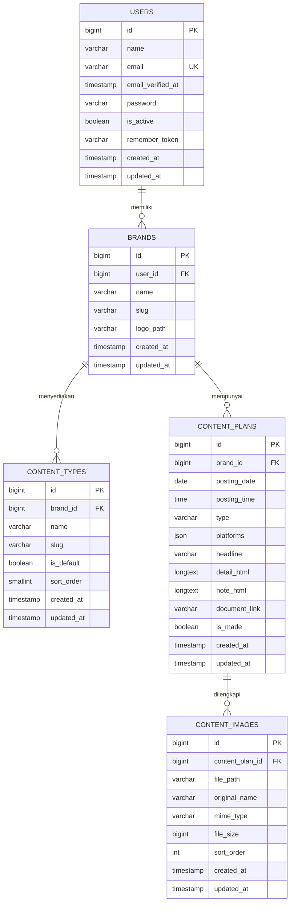
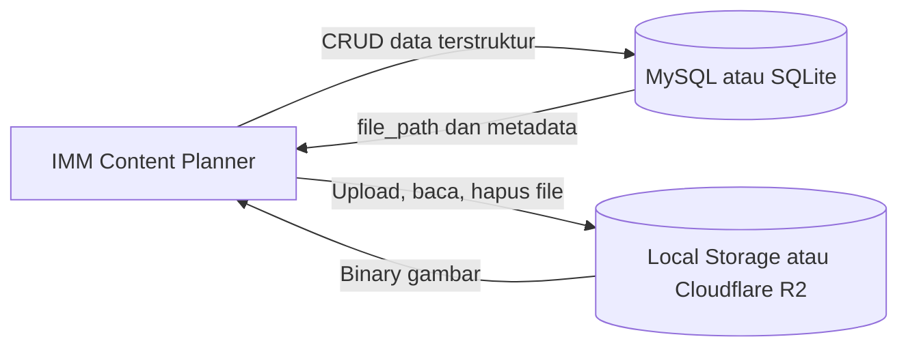

# Rancangan Database

## 1. Tujuan Rancangan

Basis data IMM Content Planner dirancang untuk memisahkan data berdasarkan pengguna dan brand, menyimpan jadwal konten secara terstruktur, serta menjaga hubungan antara jadwal dan media pendukung. Implementasi production menggunakan MySQL, sedangkan SQLite dapat digunakan untuk pengembangan lokal dan automated test.

## 2. Entity Relationship Diagram

Diagram berikut memuat tabel domain utama aplikasi. Blok Mermaid dapat ditempel ke [Mermaid Live Editor](https://mermaid.live/) untuk diekspor menjadi SVG atau PNG.

## 3. Relasi dan Kardinalitas

| Entitas asal | Relasi | Entitas tujuan | Penjelasan |
|---|---|---|---|
| `users` | 1 : N | `brands` | Satu pengguna dapat memiliki banyak brand; satu brand hanya dimiliki satu pengguna. |
| `brands` | 1 : N | `content_types` | Setiap brand memiliki katalog tipe konten sendiri. |
| `brands` | 1 : N | `content_plans` | Satu brand dapat memiliki banyak jadwal konten. |
| `content_plans` | 1 : N | `content_images` | Satu jadwal dapat memiliki nol sampai dua belas gambar. |

Kolom `content_plans.type` menyimpan slug dari `content_types.slug`. Hubungan tersebut divalidasi oleh aplikasi berdasarkan `brand_id`, tetapi tidak menggunakan foreign key langsung. Pendekatan ini mempertahankan data jadwal ketika nama tampilan tipe berubah dan membuat parameter filter tetap sederhana.

## 4. Kamus Data Tabel Utama

### 4.1 `users`

| Kolom | Tipe | Aturan | Fungsi |
|---|---|---|---|
| `id` | BIGINT | Primary key | Identitas pengguna. |
| `name` | VARCHAR | Wajib | Nama pengguna. |
| `email` | VARCHAR | Wajib, unik | Identitas login dan reset password. |
| `email_verified_at` | TIMESTAMP | Nullable | Waktu verifikasi email. |
| `password` | VARCHAR | Wajib | Password yang telah di-hash. |
| `is_active` | BOOLEAN | Default `true` | Menentukan izin menggunakan aplikasi. |
| `remember_token` | VARCHAR | Nullable | Token fitur ingat saya. |

### 4.2 `brands`

| Kolom | Tipe | Aturan | Fungsi |
|---|---|---|---|
| `id` | BIGINT | Primary key | Identitas brand. |
| `user_id` | BIGINT | Foreign key | Pemilik brand. |
| `name` | VARCHAR(120) | Wajib | Nama brand. |
| `slug` | VARCHAR(150) | Unik per pengguna | Identifier ramah URL. |
| `logo_path` | VARCHAR | Nullable | Object key logo pada storage. |

### 4.3 `content_types`

| Kolom | Tipe | Aturan | Fungsi |
|---|---|---|---|
| `id` | BIGINT | Primary key | Identitas tipe. |
| `brand_id` | BIGINT | Foreign key | Brand pemilik katalog tipe. |
| `name` | VARCHAR(60) | Wajib | Nama yang tampil pada antarmuka. |
| `slug` | VARCHAR(30) | Unik per brand | Nilai yang disimpan pada jadwal dan filter. |
| `is_default` | BOOLEAN | Default `false` | Penanda tipe bawaan. |
| `sort_order` | SMALLINT | Default `100` | Urutan pilihan dan statistik. |

Tipe bawaan adalah `carousel`, `reels`, dan `single`. Pengguna dapat menambahkan tipe lain untuk brand tertentu.

### 4.4 `content_plans`

| Kolom | Tipe | Aturan | Fungsi |
|---|---|---|---|
| `id` | BIGINT | Primary key | Identitas jadwal. |
| `brand_id` | BIGINT | Foreign key | Brand pemilik jadwal. |
| `posting_date` | DATE | Wajib | Tanggal publikasi. |
| `posting_time` | TIME | Nullable | Waktu publikasi format 24 jam. |
| `type` | VARCHAR(30) | Wajib | Slug tipe konten. |
| `platforms` | JSON | Wajib | Pilihan platform, misalnya Instagram dan TikTok. |
| `headline` | VARCHAR | Wajib | Judul atau topik konten. |
| `detail_html` | LONGTEXT | Nullable | Detail, script, atau caption yang telah disanitasi. |
| `note_html` | LONGTEXT | Nullable | Catatan produksi yang telah disanitasi. |
| `document_link` | VARCHAR(2048) | Nullable | Tautan dokumen eksternal. |
| `is_made` | BOOLEAN | Default `false` | Status pekerjaan konten. |

### 4.5 `content_images`

| Kolom | Tipe | Aturan | Fungsi |
|---|---|---|---|
| `id` | BIGINT | Primary key | Identitas metadata gambar. |
| `content_plan_id` | BIGINT | Foreign key | Jadwal pemilik gambar. |
| `file_path` | VARCHAR | Wajib | Object key file pada storage. |
| `original_name` | VARCHAR | Wajib | Nama file saat diunggah. |
| `mime_type` | VARCHAR(100) | Wajib | Tipe media hasil optimasi. |
| `file_size` | BIGINT UNSIGNED | Wajib | Ukuran file dalam byte. |
| `sort_order` | INT UNSIGNED | Default `0` | Urutan gambar pada preview. |

## 5. Tabel Pendukung Framework

| Tabel | Fungsi |
|---|---|
| `password_reset_tokens` | Menyimpan token reset password sementara berdasarkan email. |
| `sessions` | Menyimpan session login, alamat IP, user agent, payload, dan waktu aktivitas. |
| `cache`, `cache_locks` | Penyimpanan cache dan lock Laravel. |
| `jobs`, `job_batches`, `failed_jobs` | Mendukung proses queue dan pencatatan kegagalan job. |
| `migrations` | Mencatat migration yang telah dijalankan. |

## 6. Constraint dan Indeks

- `users.email` bersifat unik.
- Kombinasi `brands.user_id` dan `brands.slug` bersifat unik.
- Kombinasi `content_types.brand_id` dan `content_types.slug` bersifat unik.
- Foreign key pada tabel domain menggunakan `ON DELETE CASCADE`.
- `content_plans` memiliki indeks pada `posting_date`, `(brand_id, posting_date)`, dan `(brand_id, type)`.
- `content_images` memiliki indeks pada `(content_plan_id, sort_order)`.
- `content_types` memiliki indeks pada `(brand_id, sort_order)`.

## 7. Aturan Integritas Data

1. Pengguna hanya dapat mengakses brand miliknya melalui policy aplikasi.
2. Penghapusan pengguna menghapus seluruh brand terkait.
3. Penghapusan brand menghapus tipe, jadwal, dan metadata gambar terkait.
4. Penghapusan jadwal menghapus metadata gambar terkait.
5. Objek media dihapus melalui service aplikasi karena berada di luar basis data.
6. Tipe konten harus tersedia pada katalog brand sebelum jadwal disimpan.
7. Minimal satu platform harus dipilih.
8. Maksimal 12 gambar diperbolehkan pada setiap jadwal.
9. Rich text disanitasi sebelum masuk ke basis data.

## 8. Pemisahan Database dan Object Storage

Basis data tidak menyimpan binary gambar. Hal ini mengurangi ukuran database, mempermudah backup data relasional, dan memungkinkan file disajikan melalui storage yang lebih sesuai untuk objek berukuran besar.
