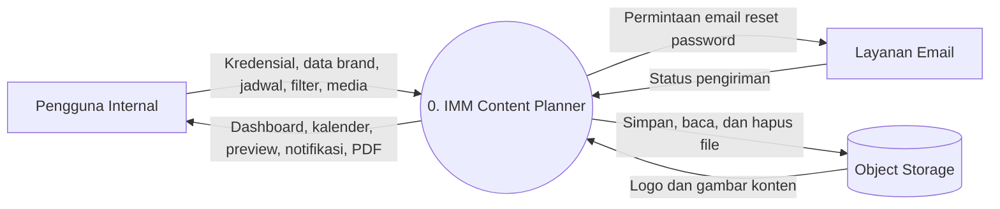
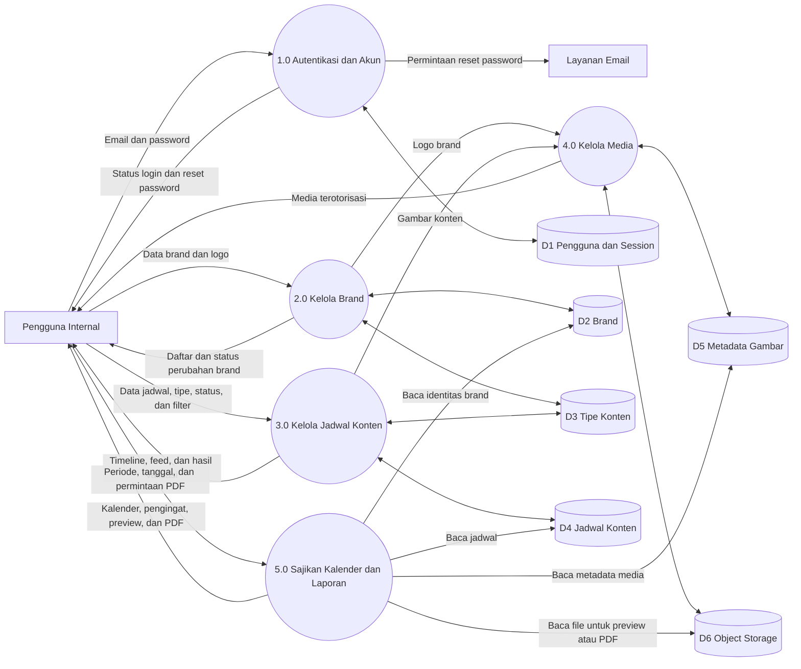
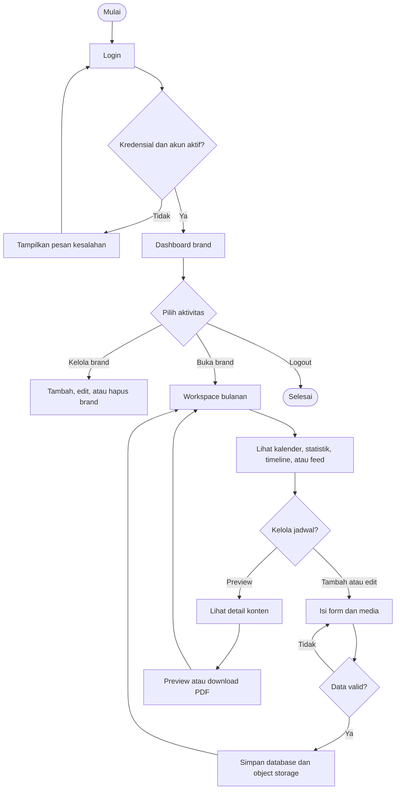

# Alur Sistem Level 0

## 1. Tujuan Diagram

Diagram alir data level 0 menggambarkan batas sistem IMM Content Planner, aktor yang berinteraksi, kelompok proses utama, serta penyimpanan data yang digunakan. Pengguna pada diagram adalah staf internal yang telah memperoleh akun dari administrator sistem.

## 2. Diagram Konteks

Diagram konteks memperlakukan aplikasi sebagai satu proses utama.

## 3. Data Flow Diagram Level 0

## 4. Deskripsi Proses

### 1.0 Autentikasi dan Akun

1. Pengguna memasukkan email dan password.
2. Sistem memvalidasi kredensial dan status `is_active`.
3. Jika valid, sistem membuat session dan mengarahkan pengguna ke dashboard brand.
4. Pengguna dapat meminta tautan reset password melalui email.
5. Logout menghapus session aktif.

### 2.0 Kelola Brand

1. Sistem mengambil daftar brand berdasarkan pengguna yang sedang login.
2. Pengguna dapat menambah, mengubah, membuka, atau menghapus brand.
3. Saat brand dibuat, sistem menambahkan tipe konten bawaan.
4. Logo diproses oleh modul media dan object key disimpan pada tabel `brands`.
5. Penghapusan brand juga menghapus jadwal, tipe, metadata, dan objek media terkait.

### 3.0 Kelola Jadwal Konten

1. Pengguna memilih brand dan periode kerja.
2. Sistem membaca jadwal berdasarkan `brand_id`, tahun, dan bulan.
3. Pengguna dapat membuat, mengubah, menghapus, atau mengganti status jadwal.
4. Sistem memvalidasi tanggal, waktu, tipe, platform, teks, tautan, dan jumlah gambar.
5. Data ditampilkan sebagai timeline atau feed dan dapat difilter berdasarkan tipe serta status.

### 4.0 Kelola Media

1. Sistem menerima logo atau gambar yang diunggah.
2. File divalidasi dan dioptimasi sebelum disimpan.
3. File disimpan pada filesystem lokal atau Cloudflare R2.
4. Basis data menyimpan object key, nama asli, MIME type, ukuran, dan urutan.
5. Media privat hanya dikirim setelah autentikasi dan otorisasi kepemilikan berhasil.

### 5.0 Sajikan Kalender dan Laporan

1. Sistem mengelompokkan jadwal berdasarkan tanggal untuk kalender bulanan.
2. Sistem menampilkan maksimal lima jadwal mendatang.
3. Pengguna dapat membuka preview detail sebuah jadwal.
4. Sistem membaca brand, jadwal, dan media untuk menghasilkan PDF.
5. PDF dapat ditampilkan inline atau diunduh.

## 5. Alur Utama Pengguna

## 6. Aturan Keamanan pada Alur

- Seluruh proses selain login dan reset password membutuhkan session aktif.
- Middleware menolak pengguna dengan akun tidak aktif.
- Policy memastikan brand, jadwal, dan media hanya dapat diakses pemiliknya.
- Perubahan data menggunakan perlindungan CSRF.
- Upload, rich text, URL, dan pilihan tipe divalidasi sebelum disimpan.
- Operasi database penting dan upload media menggunakan transaksi atau mekanisme kompensasi agar metadata dan file tetap konsisten.
