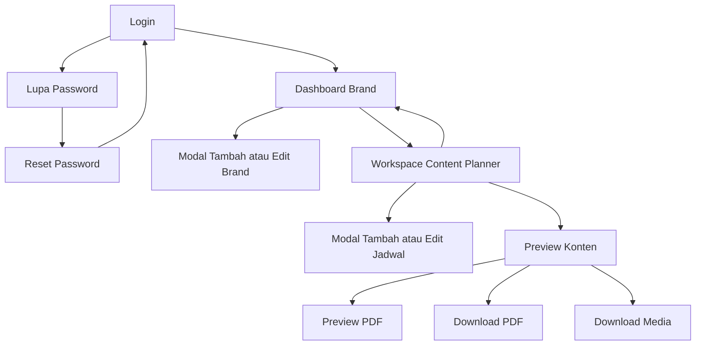

# Rancangan Antarmuka

## 1. Tujuan Perancangan

Antarmuka IMM Content Planner dirancang untuk membantu pengguna internal mengelola banyak brand dan jadwal konten tanpa kehilangan konteks. Informasi yang paling sering digunakan, yaitu periode, statistik, kalender, status, dan jadwal, ditempatkan pada area yang mudah dipindai. Operasi tambah dan edit menggunakan modal agar pengguna tetap berada pada workspace yang sama.

## 2. Prinsip Desain

1. **Konsisten**: tombol, kartu, modal, warna status, dan tipografi menggunakan pola yang sama.
2. **Berorientasi tugas**: aksi utama seperti Tambah, Simpan, Preview, dan Download terlihat jelas.
3. **Memberi umpan balik**: validasi, toast, state aktif, empty state, dan konfirmasi hapus menjelaskan hasil tindakan.
4. **Mencegah kehilangan data**: draft form dipertahankan ketika modal tidak sengaja tertutup selama halaman belum dimuat ulang.
5. **Responsif**: grid, sidebar, kartu, dan modal menyesuaikan desktop, tablet, dan perangkat bergerak.
6. **Aksesibel**: kontrol memiliki label, focus state, kontras, serta elemen semantik yang sesuai.
7. **Aman**: media privat dan aksi perubahan data hanya tersedia setelah autentikasi serta otorisasi.

## 3. Peta Navigasi



## 4. Sistem Visual

| Elemen | Rancangan |
|---|---|
| Identitas | Logo IMM dan judul “IMM Content Planner”. |
| Tema | Light mode dan dark mode dengan pilihan tersimpan pada browser. |
| Warna utama | Merah marun sebagai aksen, hitam atau putih untuk aksi primer sesuai tema. |
| Latar | Pola grid untuk memberi karakter visual tanpa mengganggu keterbacaan. |
| Kartu | Sudut membulat, border halus, dan surface yang mengikuti tema. |
| Tipografi | Sans-serif dengan hierarki tegas pada judul, angka statistik, label, dan isi. |
| Ikon | SVG untuk tambah, edit, hapus, preview, kalender, platform, dan download. |
| Notifikasi | Toast otomatis hilang dan dapat ditutup manual. |

## 5. Rancangan Halaman

### 5.1 Halaman Login

**Tujuan:** mengautentikasi pengguna sebelum masuk ke sistem.

**Komponen:**

- Logo dan nama aplikasi.
- Input email.
- Input password.
- Checkbox “Ingat saya”.
- Tombol Login.
- Tautan Lupa password.
- Pesan validasi dan status reset password.

```text
+--------------------------------------+
|                 LOGO                 |
|         IMM Content Planner          |
|                                      |
| Email                                |
| [                                  ] |
| Password                             |
| [                                  ] |
| [ ] Ingat saya                       |
| [              LOGIN               ] |
|            Lupa password?            |
+--------------------------------------+
```

### 5.2 Dashboard Brand

**Tujuan:** menampilkan seluruh workspace brand milik pengguna.

**Komponen:**

- Judul dan deskripsi aplikasi.
- Theme toggle, Tambah brand, dan Logout.
- Grid maksimal empat kolom pada desktop.
- Kartu berisi logo, nama, jumlah konten total, tombol Buka, Edit, dan Hapus.
- Kartu Tambah brand.
- Modal tambah atau edit brand dengan preview logo.

```text
+--------------------------------------------------------------------+
| IMM Content Planner             [Dark|Light] [+ Tambah] [Logout]   |
|--------------------------------------------------------------------|
| [Brand A]   [Brand B]   [Brand C]   [Brand D]                     |
| logo, total logo, total logo, total logo, total                    |
| Buka E H    Buka E H    Buka E H    Buka E H                      |
|                                                                    |
| [+ Tambah brand]                                                   |
+--------------------------------------------------------------------+
```

### 5.3 Workspace Content Planner

**Tujuan:** menjadi pusat pemantauan dan pengelolaan jadwal satu brand.

**Sidebar:**

- Tombol kembali ke semua brand.
- Identitas brand.
- Navigasi bulan sebelumnya dan berikutnya.
- Kartu statistik total dan tipe yang dapat diklik sebagai filter.
- Kartu status Sudah dibuat dan Belum dibuat yang dapat diklik.
- Tombol Reset filter ketika filter aktif.
- Kalender bulanan interaktif.
- Panel lima jadwal mendatang.

**Area utama:**

- Judul periode dan nama brand.
- Theme toggle dan tombol Tambah.
- Tab Timeline dan Feed.
- Chip filter tipe konten.
- State filter status aktif.
- Daftar konten atau empty state.
- Tombol Preview, Edit, Hapus, dan ubah status.

```text
+----------------------+------------------------------------------------+
| Semua brand          | Content Planner Bulan Tahun  [Tema] [+ Tambah] |
| Brand dan logo       |------------------------------------------------|
| < Bulan Tahun >      | [Timeline] [Feed]                               |
| [Total] [Carousel]   | [Semua] [Carousel] [Reels] [Single post]        |
| [Reels] [Single]     |------------------------------------------------|
| [Sudah] [Belum]      | Tanggal | Kartu jadwal                          |
| Kalender             |         | headline, tipe, waktu, status         |
| Jadwal mendatang     |         | detail, catatan, media, aksi          |
+----------------------+------------------------------------------------+
```

### 5.4 Modal Form Jadwal

**Tujuan:** menambah atau mengubah seluruh informasi jadwal tanpa meninggalkan workspace.

**Field:**

- Tanggal publikasi.
- Jam posting format 24 jam.
- Tipe konten dengan opsi menambah tipe baru.
- Platform Instagram dan TikTok.
- Headline.
- Rich text Detail/script.
- Rich text Catatan.
- Upload maksimal 12 gambar.
- Daftar media lama dengan pilihan Pertahankan atau Hapus.
- Link dokumen.
- Tombol Batal dan Simpan.

**Perilaku:**

- Modal dapat di-scroll jika isinya lebih tinggi dari viewport.
- Klik di luar modal dapat menutup form, tetapi draft tetap tersedia selama halaman belum dimuat ulang.
- Saat edit, upload baru berarti menambah media; media lama diatur secara terpisah.
- Pesan validasi ditampilkan dekat field terkait.

### 5.5 Preview Konten

**Tujuan:** menyajikan satu jadwal dalam format yang siap ditinjau.

**Komponen:**

- Tombol kembali ke workspace.
- Theme toggle.
- Tombol Preview PDF dan Download PDF.
- Identitas brand, headline, tanggal, waktu, tipe, platform, dan status.
- Detail atau script.
- Catatan produksi.
- Galeri media dengan tombol Download.
- Link dokumen.

### 5.6 Preview dan Download PDF

**Tujuan:** menghasilkan ringkasan portabel untuk ditinjau atau dibagikan secara internal.

**Isi PDF:**

- Identitas IMM dan brand.
- Informasi jadwal dan status.
- Platform serta tipe konten.
- Detail atau script dan catatan.
- Gambar pendukung yang dapat dibaca dari private storage.
- Link dokumen.

Preview menggunakan disposition `inline`, sedangkan download menggunakan `attachment` dengan nama file yang aman.

### 5.7 Reset Password

**Tujuan:** memulihkan akses pengguna melalui email.

**Komponen:**

- Form permintaan tautan reset berdasarkan email.
- Form password baru dan konfirmasi password.
- Status keberhasilan atau kesalahan.
- Tautan kembali ke login.

## 6. State Antarmuka

| State | Respons antarmuka |
|---|---|
| Memuat media | Browser menggunakan lazy loading dan decoding asynchronous. |
| Data kosong | Menampilkan empty state dan arahan untuk menambah konten. |
| Filter aktif | Kartu atau chip diberi visual aktif dan tombol Reset filter muncul. |
| Berhasil | Toast sukses muncul, dapat ditutup, dan hilang otomatis. |
| Validasi gagal | Pesan error muncul dan input sebelumnya dipertahankan. |
| Konfirmasi hapus | Dialog konfirmasi menjelaskan data yang akan ikut terhapus. |
| Media gagal ditemukan | Endpoint mengembalikan status 404. |
| Tidak berwenang | Sistem mengembalikan status 403 atau mengarahkan ke login. |

## 7. Responsivitas

| Ukuran layar | Perilaku |
|---|---|
| Desktop | Dashboard hingga empat kolom; workspace memakai sidebar sticky dan area konten lebar. |
| Tablet | Jumlah kolom berkurang; jarak dan ukuran kontrol disesuaikan. |
| Mobile | Konten menjadi satu kolom; header dan tombol dapat membungkus; modal memenuhi sebagian besar layar. |

Sidebar desktop memiliki tinggi maksimum berdasarkan viewport dan dapat di-scroll secara internal. Dengan demikian, statistik, kalender, dan jadwal mendatang tetap dapat diakses tanpa membuat keseluruhan halaman terlalu panjang.

## 8. Validasi Rancangan

Rancangan antarmuka dinilai berhasil apabila pengguna dapat:

1. Menemukan brand dan membuka workspace yang benar.
2. Mengetahui jumlah, tipe, dan status konten pada periode terpilih.
3. Menemukan jadwal melalui kalender, timeline, feed, atau pengingat.
4. Menambah dan mengedit jadwal tanpa kebingungan terhadap media lama dan media baru.
5. Melihat serta mengunduh gambar dan PDF.
6. Menggunakan fitur utama pada tema terang, tema gelap, dan berbagai ukuran layar.

## 9. Referensi Implementasi

### Dashboard Brand


### Workspace Content Planner


